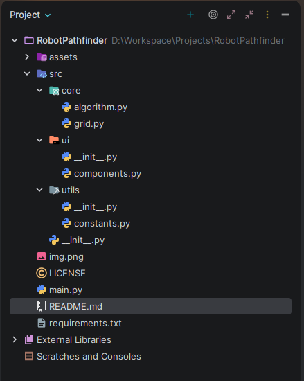
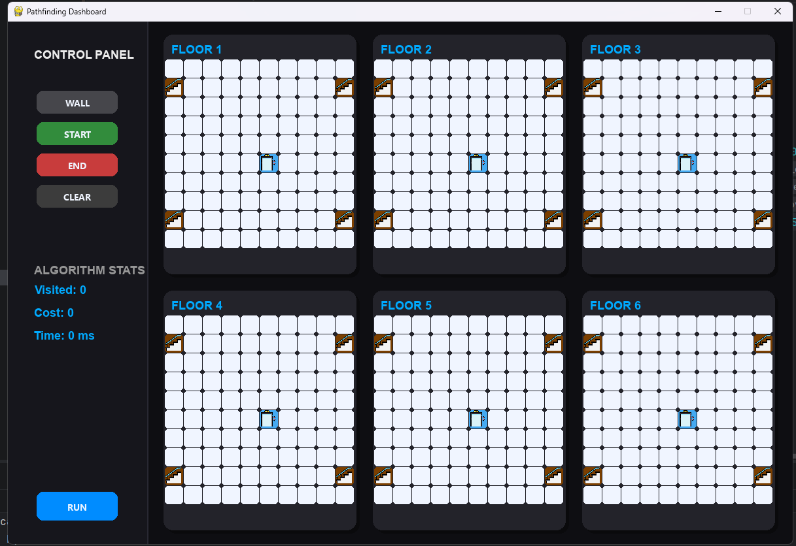
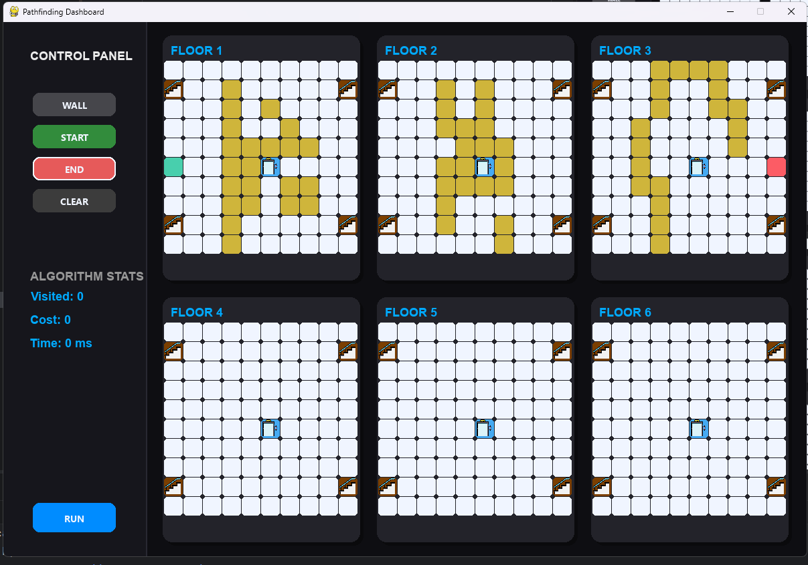
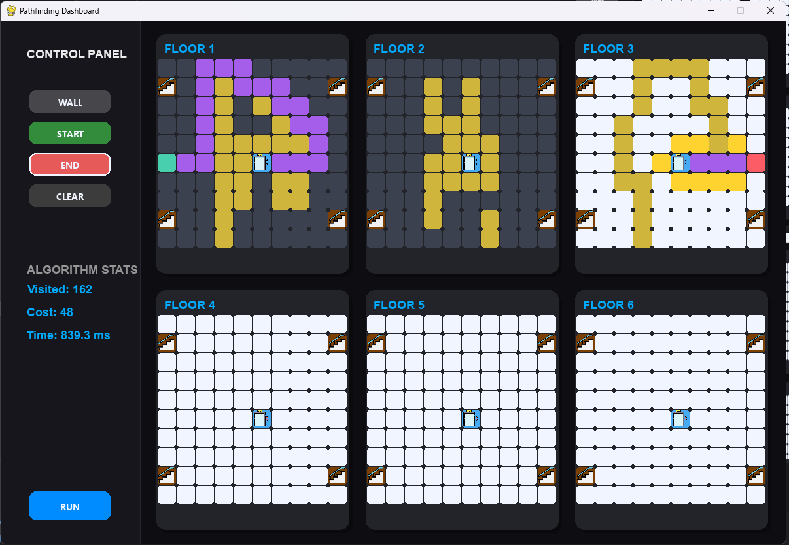
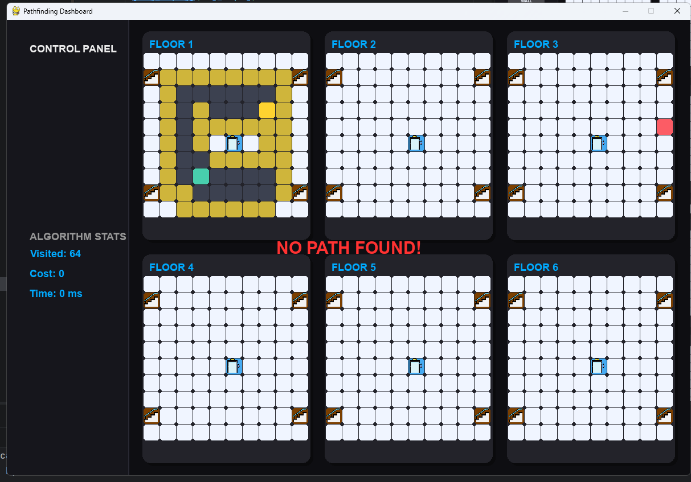

# 🤖 RobotPathfinder

A multi-floor pathfinding visualizer built with **Python** and **Pygame**, implementing the **A\* (A-Star) algorithm** to find optimal paths across multiple building floors using elevators and stairs.

---

## 📸 Screenshots

### Project Structure


> *The project follows a clean modular structure with separate layers for core logic, UI components, and utility constants.*

---

## 🖥️ Output / Demo

### Main Dashboard


### Pathfinding in Action


### Multi-Floor Navigation


### No Path Found


---

## ✨ Features

- 🗺️ **Multi-Floor Grid Visualization** — Navigate across up to 6 floors displayed as interactive grid cards
- ⚡ **A\* Pathfinding Algorithm** — Efficient shortest path search using Manhattan Distance heuristic
- 🛗 **Elevator & Stairs Support** — Dynamic traversal cost system (Move: 1, Elevator: 8, Stairs: 12)
- 🖱️ **Interactive Drawing Tools** — Place walls, set start/end points with mouse clicks
- 📊 **Real-time Algorithm Stats** — View visited nodes, path cost, and execution time
- 🎨 **Dark-themed Dashboard UI** — Clean dark-navy control panel with floor cards

---

## 🗂️ Project Structure

```
RobotPathfinder/
├── assets/
│   ├── elevator.png         # Elevator icon
│   └── stairs.png           # Stairs icon
├── src/
│   ├── core/
│   │   ├── algorithm.py     # A* pathfinding algorithm
│   │   └── grid.py          # Node class & grid construction
│   ├── ui/
│   │   ├── __init__.py
│   │   └── components.py    # Button UI component
│   ├── utils/
│   │   ├── __init__.py
│   │   └── constants.py     # Colors, costs, screen config
│   └── __init__.py
├── main.py                  # Entry point
├── requirements.txt
├── LICENSE
└── README.md
```

---

## 🚀 Getting Started

### Prerequisites

- Python 3.8+
- pip

### Installation

```bash
# Clone the repository
git clone https://github.com/yourusername/RobotPathfinder.git
cd RobotPathfinder

# Install dependencies
pip install -r requirements.txt

# Run the application
python main.py
```

---

## 🎮 How to Use

| Action | Description |
|--------|-------------|
| Click **WALL** → drag on grid | Draw walls/obstacles |
| Click **START** → click on grid | Place the start node |
| Click **END** → click on grid | Place the destination node |
| Click **RUN** | Start the A\* pathfinding |
| Click **CLEAR** | Reset the entire grid |
| Right-click on node | Remove/reset a node |

### Special Nodes

- 🔵 **Elevators** — Pre-placed at the center of each floor. Connects adjacent floors (cost: 8).
- 🟫 **Stairs** — Pre-placed at corner edges of each floor. Connects adjacent floors (cost: 12).

---

## ⚙️ Algorithm Details

### A\* (A-Star) Search

The algorithm uses a **priority queue (min-heap)** to always expand the most promising node based on:

```
f(n) = g(n) + h(n)
```

| Term | Meaning |
|------|---------|
| `g(n)` | Actual cost from start to node `n` |
| `h(n)` | Estimated cost from `n` to goal (Manhattan Distance) |
| `f(n)` | Total estimated path cost |

### Traversal Costs

```python
MOVE_COST      = 1    # Regular tile movement
ELEVATOR_COST  = 8    # Using elevator to change floor
STAIRS_COST    = 12   # Using stairs to change floor
```

### Performance Metrics

After each run, the sidebar displays:
- **Visited** — Total nodes explored
- **Cost** — Total path cost
- **Time** — Execution time in milliseconds

---

## 🎨 Color Reference

| Color | Meaning |
|-------|---------|
| ⬜ White | Empty tile |
| 🟡 Gold | Wall |
| 🟢 Teal | Start node |
| 🔴 Red | End node |
| 🔵 Blue | Elevator |
| 🟫 Brown | Stairs |
| 🟣 Purple | Final path |
| 🟡 Yellow | Scanning (open set) |
| ⬛ Dark grey | Visited (closed set) |

---

## 📦 Dependencies

```
pygame
```

Install via:
```bash
pip install pygame
```

---

## 📄 License

This project is licensed under the terms in the [LICENSE](LICENSE) file.

---
##  Author
 
**Md. Mehadi Hasan**
 
Built as a visualization tool for exploring multi-floor pathfinding with dynamic traversal costs.